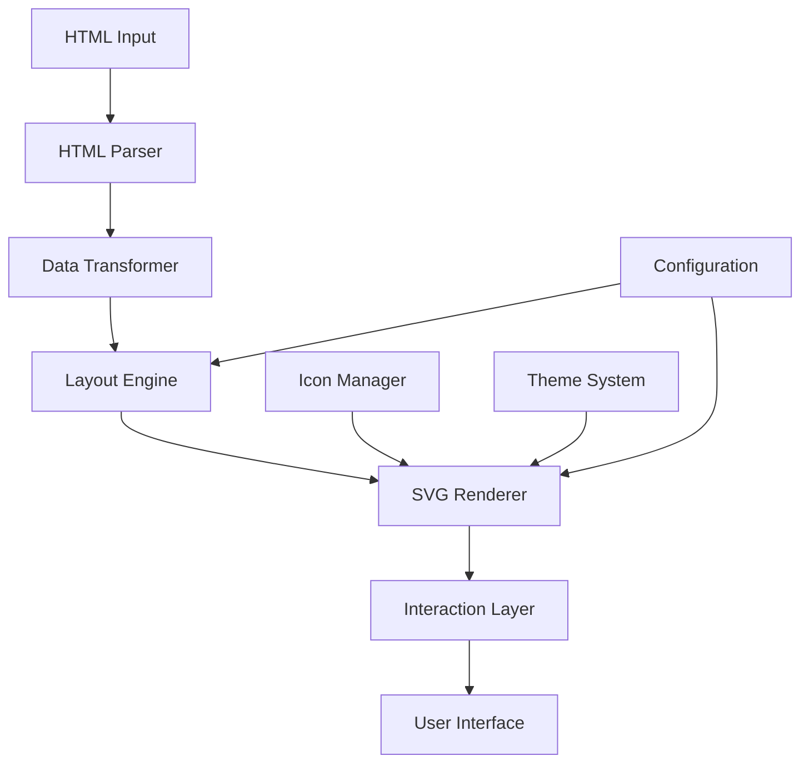

# Design Document

## Overview

The HTML Diagram Library is a client-side JavaScript library that transforms HTML-like markup into interactive architectural diagrams. The library consists of four main components: an HTML parser, a layout engine using force-directed algorithms, a rendering system with SVG output, and an interaction layer for user engagement.

The architecture follows a pipeline approach: HTML input → parsing → data transformation → layout calculation → SVG rendering → interaction binding. This design ensures separation of concerns and makes the library extensible and maintainable.

## Architecture

### High-Level Architecture



### Core Components

1. **HTML Parser**: Extracts custom elements and attributes from HTML markup
2. **Data Transformer**: Converts parsed HTML into graph data structures
3. **Layout Engine**: Calculates node positions using force-directed algorithms
4. **SVG Renderer**: Generates SVG elements for visual representation
5. **Interaction Layer**: Handles user interactions (hover, click, zoom, pan)
6. **Icon Manager**: Manages icon loading, caching, and fallbacks
7. **Theme System**: Handles styling and visual consistency

## Components and Interfaces

### HTMLParser Class

```javascript
class HTMLParser {
  parse(htmlString: string): ParsedElement[]
  validateElements(elements: ParsedElement[]): ValidationResult
  extractConnections(elements: ParsedElement[]): Connection[]
}

interface ParsedElement {
  type: string
  id: string
  attributes: Record<string, string>
  children: ParsedElement[]
  connections: string[]
}
```

### DataTransformer Class

```javascript
class DataTransformer {
  transform(elements: ParsedElement[]): GraphData
  createNodes(elements: ParsedElement[]): Node[]
  createEdges(connections: Connection[]): Edge[]
}

interface GraphData {
  nodes: Node[]
  edges: Edge[]
}

interface Node {
  id: string
  type: string
  label: string
  icon: string
  metadata: Record<string, any>
}
```

### LayoutEngine Class

```javascript
class LayoutEngine {
  constructor(config: LayoutConfig)
  calculateLayout(graphData: GraphData): LayoutResult
  applyForces(nodes: Node[], edges: Edge[]): void
  stabilize(): Promise<void>
}

interface LayoutConfig {
  forceStrength: number
  linkDistance: number
  nodeRepulsion: number
  centerForce: number
  iterations: number
}
```

### SVGRenderer Class

```javascript
class SVGRenderer {
  constructor(container: HTMLElement, iconManager: IconManager)
  render(layoutResult: LayoutResult): void
  updatePositions(nodes: Node[]): void
  applyTheme(theme: Theme): void
}
```

### InteractionLayer Class

```javascript
class InteractionLayer {
  constructor(svgElement: SVGElement)
  enableZoom(): void
  enablePan(): void
  addTooltips(nodes: Node[]): void
  bindClickHandlers(callback: (node: Node) => void): void
}
```

### IconManager Class

```javascript
class IconManager {
  constructor(config: IconConfig)
  getIcon(type: string): Promise<string>
  loadExternalIcon(url: string): Promise<string>
  cacheIcon(type: string, iconData: string): void
}

interface IconConfig {
  iconSources: Record<string, string>
  fallbackIcon: string
  externalSources: string[]
}
```

## Data Models

### Core Data Structures

```javascript
// Input data model from HTML parsing
interface DiagramElement {
  tagName: string
  id: string
  className?: string
  attributes: {
    name?: string
    brand?: string
    connects?: string
    [key: string]: string
  }
  children: DiagramElement[]
}

// Internal graph representation
interface GraphNode {
  id: string
  type: string
  label: string
  position: { x: number, y: number }
  icon: string
  size: { width: number, height: number }
  style: NodeStyle
  metadata: Record<string, any>
}

interface GraphEdge {
  id: string
  source: string
  target: string
  type: 'connection' | 'hierarchy'
  style: EdgeStyle
}

// Layout calculation results
interface LayoutResult {
  nodes: GraphNode[]
  edges: GraphEdge[]
  bounds: { width: number, height: number }
  center: { x: number, y: number }
}
```

### Configuration Models

```javascript
interface LibraryConfig {
  layout: LayoutConfig
  icons: IconConfig
  theme: ThemeConfig
  interaction: InteractionConfig
  performance: PerformanceConfig
}

interface ThemeConfig {
  nodeStyles: Record<string, NodeStyle>
  edgeStyles: Record<string, EdgeStyle>
  colors: Record<string, string>
  fonts: FontConfig
}

interface PerformanceConfig {
  maxNodes: number
  animationDuration: number
  renderThrottle: number
  lazyLoading: boolean
}
```

## Error Handling

### Error Categories

1. **Parse Errors**: Invalid HTML syntax, unsupported elements
2. **Validation Errors**: Missing required attributes, circular references
3. **Layout Errors**: Convergence failures, memory constraints
4. **Rendering Errors**: SVG generation failures, icon loading failures
5. **Interaction Errors**: Event binding failures, browser compatibility issues

### Error Handling Strategy

```javascript
class DiagramError extends Error {
  constructor(type: ErrorType, message: string, context?: any) {
    super(message)
    this.type = type
    this.context = context
  }
}

enum ErrorType {
  PARSE_ERROR = 'PARSE_ERROR',
  VALIDATION_ERROR = 'VALIDATION_ERROR',
  LAYOUT_ERROR = 'LAYOUT_ERROR',
  RENDER_ERROR = 'RENDER_ERROR',
  INTERACTION_ERROR = 'INTERACTION_ERROR'
}

// Error recovery mechanisms
interface ErrorRecovery {
  skipInvalidElements: boolean
  useDefaultIcons: boolean
  fallbackLayout: 'grid' | 'circle' | 'tree'
  gracefulDegradation: boolean
}
```

### Validation System

```javascript
class DiagramValidator {
  validateHTML(html: string): ValidationResult
  validateConnections(elements: ParsedElement[]): ValidationResult
  validatePerformance(nodeCount: number): ValidationResult
}

interface ValidationResult {
  isValid: boolean
  errors: ValidationError[]
  warnings: ValidationWarning[]
}
```

## Testing Strategy

### Unit Testing

- **Parser Tests**: Validate HTML parsing accuracy and error handling
- **Transformer Tests**: Ensure correct data structure conversion
- **Layout Tests**: Verify force-directed algorithm calculations
- **Renderer Tests**: Check SVG output correctness
- **Icon Manager Tests**: Test icon loading and caching mechanisms

### Integration Testing

- **End-to-End Pipeline**: Test complete HTML-to-diagram transformation
- **Browser Compatibility**: Automated testing across Chrome, Firefox, Safari, Edge
- **Performance Testing**: Load testing with varying diagram sizes
- **Documentation Platform Testing**: Embedding tests in Confluence-like environments

### Visual Regression Testing

- **Screenshot Comparison**: Automated visual diff testing
- **Layout Consistency**: Ensure consistent positioning across runs
- **Theme Application**: Verify styling consistency

### Performance Testing

```javascript
// Performance benchmarks
const performanceTests = {
  smallDiagram: { nodes: 10, edges: 15, maxRenderTime: 100 },
  mediumDiagram: { nodes: 50, edges: 75, maxRenderTime: 500 },
  largeDiagram: { nodes: 200, edges: 300, maxRenderTime: 2000 }
}
```

### Cross-Platform Testing

- **Browser Matrix**: Chrome 90+, Firefox 88+, Safari 14+, Edge 90+
- **Documentation Platforms**: Confluence, Notion, GitBook, Docusaurus
- **Mobile Responsiveness**: Touch interaction testing on tablets
- **Accessibility**: Screen reader compatibility and keyboard navigation

## Implementation Considerations

### Force-Directed Algorithm Selection

The library will use D3.js force simulation as the primary layout engine due to:
- Mature, well-tested implementation
- Extensive customization options
- Good performance characteristics
- Strong community support

### Icon Strategy

- **Primary Icons**: Bundled SVG icon set for common architectural components
- **External Sources**: Integration with icon libraries (Feather, Heroicons, custom CDNs)
- **Fallback System**: Default geometric shapes when icons are unavailable
- **Caching**: Browser-based caching for external icons

### Browser Compatibility

- **Modern Browsers**: Native ES6+ support with SVG rendering
- **Polyfills**: Minimal polyfills for older browsers if needed
- **Progressive Enhancement**: Core functionality works without advanced features

### Documentation Platform Integration

- **Confluence**: Custom macro or HTML widget compatibility
- **Security**: Content Security Policy compliance
- **Isolation**: Namespace CSS and avoid global variable conflicts
- **Responsive**: Adapt to container constraints

### Distribution Strategy

- **CDN Distribution**: Single JavaScript file hosted on CDN for easy inclusion
- **No Build Required**: Users include via `<script>` tag, no npm install needed
- **Self-Contained**: All dependencies bundled, no external requirements
- **HTML-Only Usage**: Works with simple HTML pages without build tools